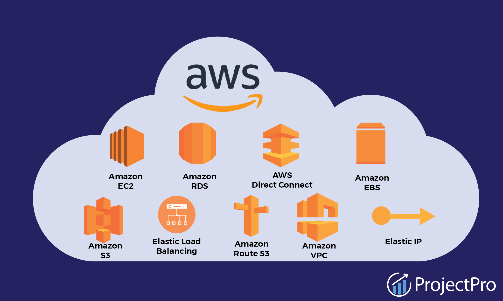

# What is AWS?

Amazon Web Services (AWS) is a comprehensive and widely adopted cloud platform offered by Amazon. It provides a broad set of cloud-based services, including computing power, storage options, and networking capabilities, which help businesses scale and grow. AWS is known for its flexibility, scalability, and reliability, making it a popular choice for companies of all sizes.

## Key Features of AWS

### 1. **Compute Services**
AWS offers scalable computing power through services like Amazon EC2 (Elastic Compute Cloud) and AWS Lambda. These services enable users to run virtual servers or serverless functions with ease.

### 2. **Storage Solutions**
AWS provides various storage options, including Amazon S3 (Simple Storage Service) for object storage, Amazon EBS (Elastic Block Store) for block storage, and Amazon Glacier for long-term archival storage.

### 3. **Networking and Content Delivery**
AWS includes services for networking and content delivery, such as Amazon VPC (Virtual Private Cloud) for network isolation and Amazon CloudFront for global content delivery and caching.

### 4. **Database Services**
AWS offers managed database services, including Amazon RDS (Relational Database Service) for traditional databases and Amazon DynamoDB for NoSQL databases, making it easy to store and manage data.

### 5. **Security and Compliance**
AWS provides a range of security and compliance services, such as AWS Identity and Access Management (IAM) for access control and AWS Key Management Service (KMS) for encryption, ensuring that data is secure and compliant with regulations.

### 6. **Machine Learning and AI**
AWS includes services for machine learning and artificial intelligence, like Amazon SageMaker for building, training, and deploying models, and AWS Lex for natural language processing.

### 7. **Cost Management**
AWS offers tools for managing and optimizing costs, such as AWS Cost Explorer for tracking expenses and AWS Budgets for setting and monitoring budget thresholds.

## How AWS Works

AWS operates on a pay-as-you-go pricing model, meaning users pay only for the services they use. AWS's global infrastructure is divided into regions and availability zones, allowing users to deploy applications in multiple locations for high availability and disaster recovery.

### Setting Up AWS

1. **Create an AWS Account:**
   - Sign up for an AWS account through the [AWS Management Console](https://aws.amazon.com/console/).

2. **Explore Services:**
   - Access and explore various AWS services through the AWS Management Console, CLI (Command Line Interface), or SDKs (Software Development Kits).

3. **Deploy Applications:**
   - Use AWS services to deploy and manage applications. For example, you can launch EC2 instances to run applications, use S3 for storage, and configure RDS for database needs.

4. **Monitor and Optimize:**
   - Use AWS CloudWatch for monitoring performance and AWS Trusted Advisor for best practices and cost optimization recommendations.

### Example Use Case

Consider a startup that needs to build and deploy a web application. Using AWS, the startup can:

1. **Compute:**
   - Launch EC2 instances to host the web application.

2. **Storage:**
   - Store static files and backups in S3.

3. **Database:**
   - Set up a relational database using Amazon RDS.

4. **Networking:**
   - Configure a VPC for secure network communication.

5. **Scaling:**
   - Utilize AWS Auto Scaling to handle increased traffic during peak times.

By leveraging AWS, the startup can focus on developing its application while AWS handles the infrastructure, scaling, and management.

## Conclusion

Amazon Web Services (AWS) is a powerful cloud computing platform that provides a vast array of services to meet the needs of businesses of all sizes. Its flexibility, scalability, and comprehensive service offerings make it an essential tool for modern cloud-based solutions.

For more detailed information, tutorials, and documentation, visit the [official AWS website](https://aws.amazon.com/).
