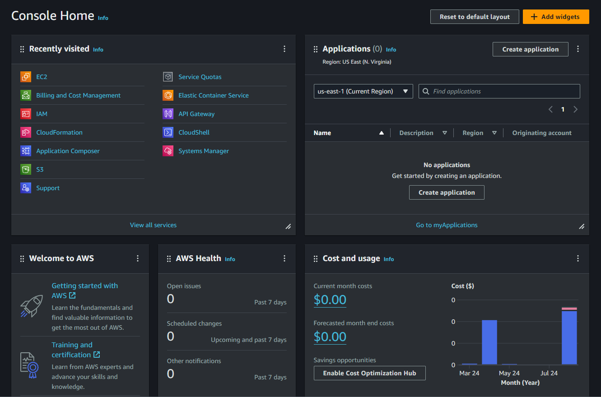
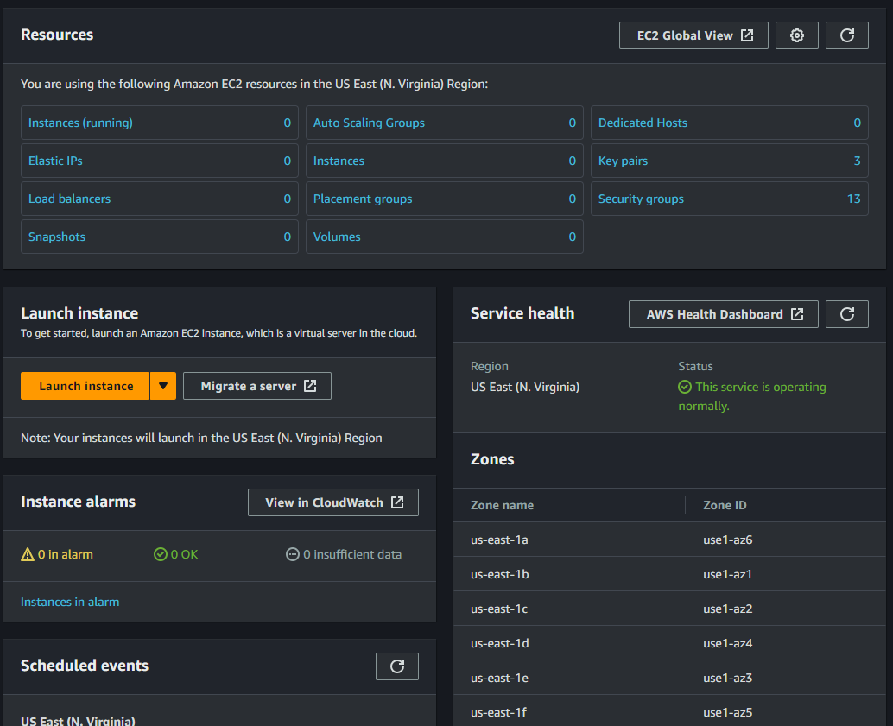
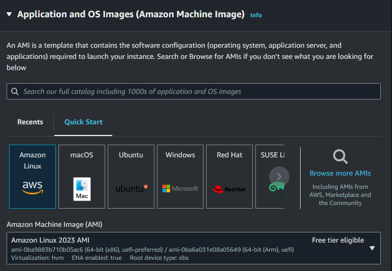
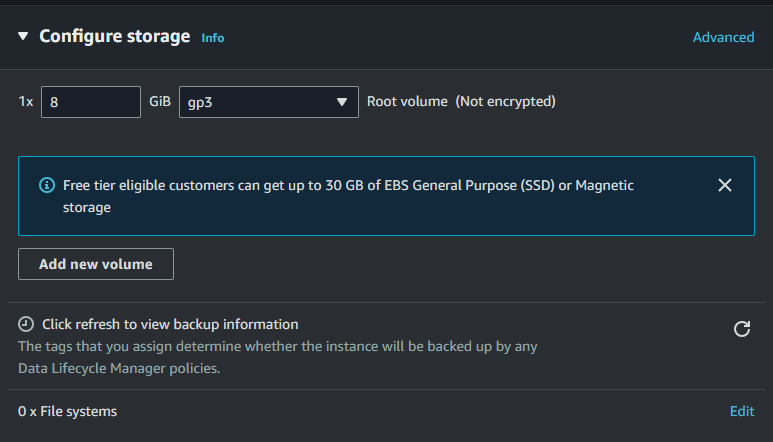

# Launching Your First EC2 Instance on AWS

Creating your first instance on AWS is a crucial step towards harnessing the power of cloud computing. This guide will walk you through the process of launching your first EC2 instance on Amazon Web Services (AWS).

## Step-by-Step Guide to Launch Your First EC2 Instance on AWS

### Step 1: Sign in to AWS Management Console

1. **Create an AWS Account**
   - If you don't have an AWS account, go to [AWS](https://aws.amazon.com/) and click on "Create an AWS Account."
   - Follow the instructions to create your account. You may need to provide a credit card for billing purposes.

2. **Sign in**
   - Once your account is created, sign in to the [AWS Management Console](https://aws.amazon.com/console/).

   

### Step 2: Navigate to the EC2 Dashboard

1. **Access EC2 Services**
   - In the AWS Management Console, find the "Services" menu at the top.
   - Under "Compute," select "EC2" to open the EC2 Dashboard OR search Ec2.
   
### Step 3: Launch an Instance

1. **Click "Launch Instance"**
   - On the EC2 Dashboard, click the "Launch Instance" button.

    

2. **Choose an Amazon Machine Image (AMI)**
   - AMIs are pre-configured templates for your instances. Choose an AMI that best suits your needs. For this guide, we'll use the free-tier eligible "Amazon Linux 2 AMI (HVM), SSD Volume Type."

3. **Choose an Instance Type**
   - Select an instance type based on your requirements. For this tutorial, the "t2.micro" instance type is a good choice as it is free-tier eligible.

4. **Configure Instance Details**
   - Click "Next: Configure Instance Details."
   - Here, you can configure various options like the number of instances, network settings, and IAM roles. For a simple setup, you can leave the default settings and click "Next: Add Storage."

   

5. **Add Storage**
   - The default storage configuration should be sufficient. You can adjust the storage size if needed. Click "Next: Add Tags."

   

6. **Add Tags**
   - Tags are key-value pairs that help you identify your instances. For example, you can add a tag with the key "Name" and value "MyFirstInstance." Click "Next: Configure Security Group."

7. **Configure Security Group**
   - Security groups act as a virtual firewall for your instance. Create a new security group and add rules to allow traffic. For example, add a rule to allow SSH access from your IP address:
     - Type: SSH
     - Protocol: TCP
     - Port Range: 22
     - Source: My IP
   - Click "Review and Launch."

8. **Review and Launch**
   - Review your instance configuration and click "Launch."

9. **Select a Key Pair**
   - AWS requires you to use a key pair to securely connect to your instance. Select "Create a new key pair," give it a name, and download the key pair file (.pem). Keep this file secure as it is used to connect to your instance.

10. **Launch Instance**
    - Click "Launch Instances." You will see a confirmation page once your instance is launching.

### Step 4: Connect to Your Instance

1. **View Your Instances**
   - Go back to the EC2 Dashboard and click on "Instances" in the left-hand menu.
   - You should see your newly launched instance listed there.

2. **Get Public DNS**
   - Select your instance and copy the Public DNS (IPv4) address from the instance description.

3. **Connect via SSH**
   - Open your terminal (or Command Prompt on Windows) and navigate to the directory where your key pair file is stored.
   - Use the following command to connect to your instance (replace `your-key-pair.pem` with your key pair file name and `ec2-user@your-instance-public-dns` with the public DNS address of your instance):

     ```bash
     chmod 400 your-key-pair.pem
     ssh -i "your-key-pair.pem" ec2-user@your-instance-public-dns
     ```

   - You should now be connected to your EC2 instance.

## Conclusion

Congratulations! You have successfully launched and connected to your first EC2 instance on AWS. From here, you can explore various AWS services and capabilities. EC2 provides scalable computing capacity in the cloud, enabling you to build and deploy applications quickly and efficiently.

Remember to stop or terminate your instance when not in use to avoid any unwanted charges. Happy cloud computing!

Feel free to reach out if you have any questions or need further assistance.
