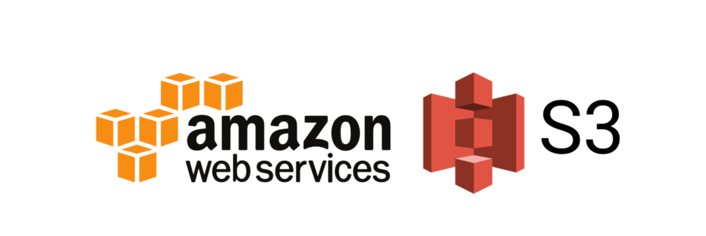
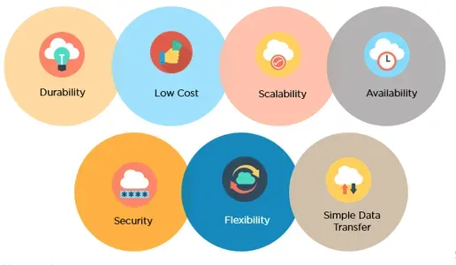

# **Exploring AWS Storage: Amazon S3**

## **Overview**

Amazon Simple Storage Service (S3) is a scalable, reliable, and secure object storage service designed for a wide range of use cases, including data backup, content storage, and big data analytics. In this blog post, we'll explore the basics of Amazon S3, how to set up an S3 bucket, and how to manage object storage effectively.

****

## **What is Amazon S3?**

Amazon S3 is an object storage service that allows you to store and retrieve any amount of data from anywhere. It's highly durable, with data being automatically replicated across multiple facilities within a region. S3 is commonly used for storing unstructured data, such as images, videos, backups, and log files, but it's flexible enough to handle virtually any type of data.

## **Key Features of Amazon S3**

* **Scalability**: S3 automatically scales to handle large amounts of data.  
* **Durability**: S3 provides 99.999999999% (11 9's) durability by redundantly storing objects across multiple devices in multiple facilities.  
* **Security**: S3 offers comprehensive security and compliance capabilities that meet stringent regulatory requirements.  
* **Cost-Effectiveness**: You pay only for the storage you use, with no upfront costs.

## **Setting Up an S3 Bucket**

### **Step 1: Sign in to the AWS Management Console**

Start by logging into your AWS account and navigating to the S3 service under the "Storage" section.

### 

### **Step 2: Create a New Bucket**

1. **Click on "Create bucket"**: This will open the bucket creation wizard.  
2. **Configure Bucket Settings**:  
   * **Bucket Name**: Choose a unique name for your bucket. The name must be globally unique and cannot be changed once created.  
   * **Region**: Select the AWS Region where you want to store your bucket. Choose a region close to your users or applications to reduce latency.  
       
3. **Set Permissions**:  
   * By default, new buckets are private, meaning only the owner has access. You can modify permissions to allow public access or grant specific permissions to users.

4. **Configure Bucket Options**:  
   * **Versioning**: Enable versioning to keep multiple versions of an object in the same bucket.  
   * **Server-Side Encryption**: Use server-side encryption to protect your data at rest.  
   * **Logging**: Enable access logging to track requests for access to your bucket.  
5. **Review and Create**:  
   * Review your settings and click on "Create bucket."

### **Step 3: Upload Objects to Your Bucket**

1. **Navigate to Your Bucket**: After the bucket is created, click on its name to enter the bucket.  
2. **Upload Objects**: Click on the "Upload" button to add files or folders to your bucket. You can set metadata, define permissions, and choose storage classes during the upload process.  
3. **Set Storage Class**:  
   * Choose the appropriate storage class based on your use case (e.g., Standard, Intelligent-Tiering, or Glacier for archival).

### **Step 4: Manage and Access Your Data**

1. **Access Control**: Use bucket policies, IAM roles, and ACLs (Access Control Lists) to control who can access your data and what actions they can perform.  
2. **Data Retrieval**: Objects can be retrieved via the AWS Management Console, CLI, or SDKs.  
3. **Lifecycle Policies**: Set lifecycle policies to automatically transition objects to different storage classes or delete them after a certain period.

## 

## **Understanding Object Storage in Amazon S3**

In Amazon S3, data is stored as objects within buckets. Each object consists of a file and metadata that describes the file. Buckets are the containers for objects, and they serve as the top-level namespace in S3.

### **Object Storage Concepts**

* **Objects**: The fundamental entities stored in S3, consisting of data, metadata, and a unique identifier.  
* **Buckets**: Containers that hold objects. Each bucket is identified by a unique name.  
* **Keys**: Unique identifiers for objects within a bucket.  
* **Metadata**: Data about the object, such as its creation date, file type, and custom metadata set by the user.

## **Conclusion**

Amazon S3 is a powerful and flexible storage service that can meet a wide variety of needs. Whether you're storing backups, hosting a static website, or archiving data, S3 provides the scalability, durability, and security needed to handle your data effectively. By understanding how to set up and manage an S3 bucket, you can leverage the full potential of AWS's object storage capabilities.