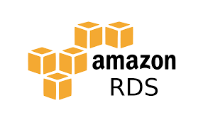

# **Managing Databases with Amazon RDS**

## **What is Amazon RDS?**

Amazon Relational Database Service (RDS) is a managed database service that makes it easy to set up, operate, and scale a relational database in the cloud. RDS supports multiple database engines, including MySQL, PostgreSQL, MariaDB, Oracle, and Microsoft SQL Server.

## **Key Features**

* **Automated Backups**: RDS automatically backs up your database and allows you to restore to any point in time.  
* **Scalability**: Easily scale your database's compute and storage resources with a few clicks.  
* **High Availability**: Use RDS Multi-AZ deployments for automatic failover and enhanced availability.  
* **Security**: Data is encrypted in transit and at rest, and you can control access with security groups and IAM roles.

## **Why Use Amazon RDS?**

* **Ease of Management**: AWS handles the heavy lifting of database management, including backups, patching, and monitoring.  
* **Cost-Effective**: Only pay for the resources you use, with the ability to scale up or down as needed.  
* **Reliability**: Built-in high availability and automated backups ensure your database is always up and running.

## **Setting Up a Database in Amazon RDS**

### **1\. Create a New RDS Instance**

1. **Sign in to the AWS Management Console** and navigate to RDS.  
2. **Click on "Create Database"**.  
3. **Choose a Database Engine**: Select your preferred engine (e.g., MySQL, PostgreSQL).  
4. **Configure the Database**:  
   * **DB Instance Class**: Choose the instance type based on your performance needs.  
   * **Storage**: Specify the storage size and type.  
   * **Database Settings**: Set up the database name, master username, and password.  
5. **Configure Advanced Settings** (Optional):  
   * **VPC**: Choose the VPC and subnet group.  
   * **Backup**: Set backup retention and maintenance windows.  
6. **Click "Create Database"** to launch your RDS instance.

### **2\. Connecting to Your RDS Database**

1. **Go to the RDS Dashboard** and find your new instance.  
2. **Get the Endpoint**: This is the address you’ll use to connect to your database.  
3. **Connect Using a Client**: Use a database client like MySQL Workbench or pgAdmin to connect, using the endpoint, username, and password.

### **3\. Managing Your Database**

* **Monitoring**: Use CloudWatch for metrics like CPU utilization, memory usage, and I/O activity.  
* **Scaling**: Adjust the instance class or storage size from the RDS dashboard as your needs grow.  
* **Backups**: Restore your database to a previous point in time if needed, or manually create snapshots.

## **Conclusion**

Amazon RDS simplifies database management, offering automated backups, scaling, and security features, all while being easy to set up and use. It's ideal for developers who want to focus on building applications without the overhead of database administration.

