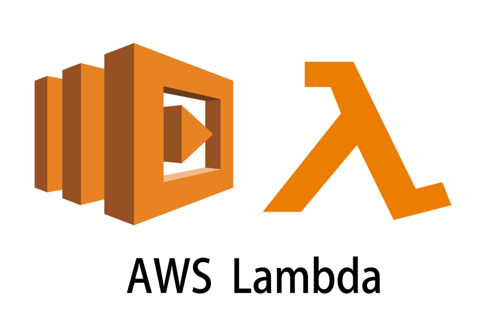
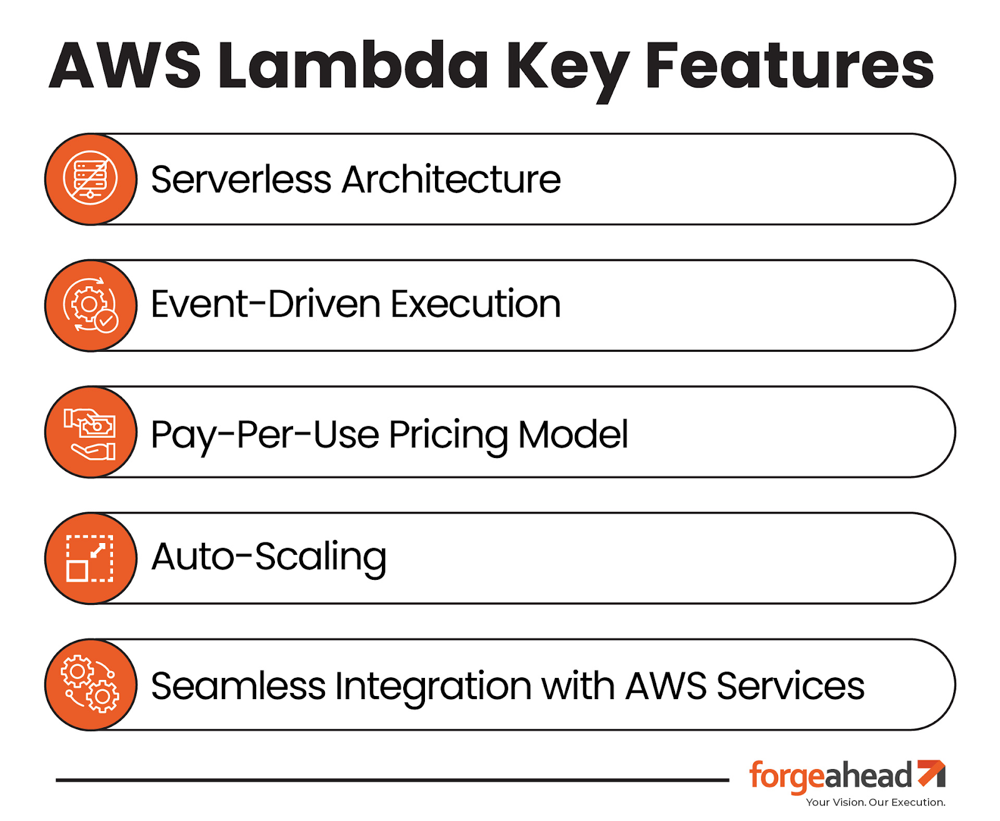
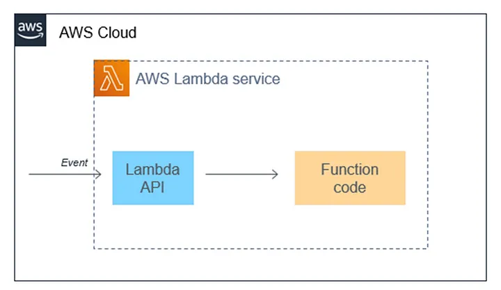
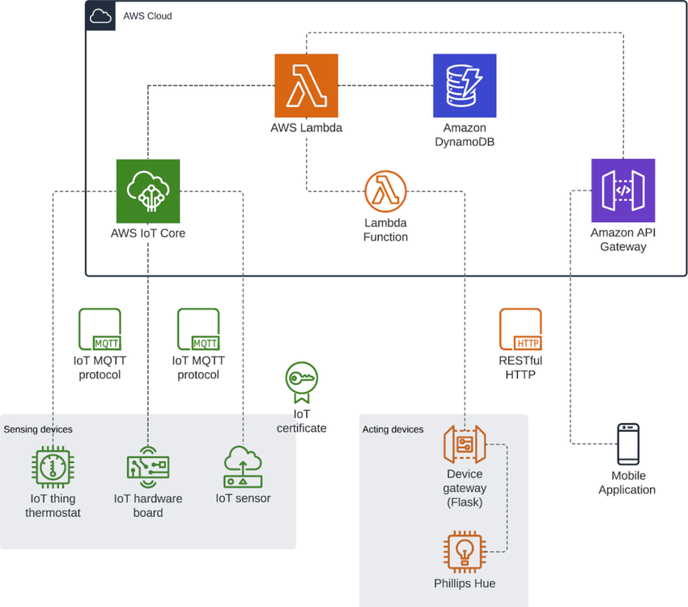
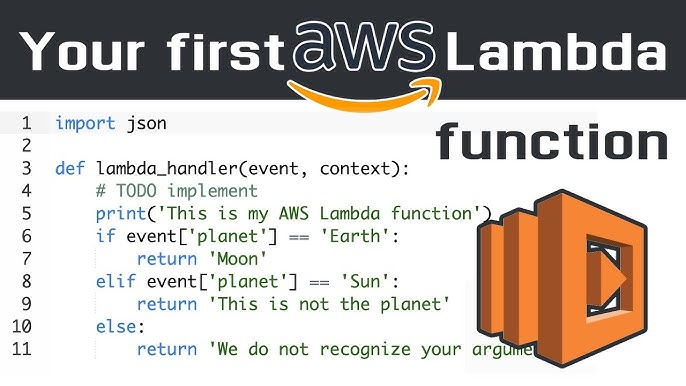

# **Introduction to Serverless Computing with AWS Lambda**


### **What is Serverless Computing?**

Serverless computing is a cloud computing model where the cloud provider automatically manages the infrastructure, allowing developers to focus solely on writing code. In this model, you don’t have to worry about provisioning, scaling, or maintaining servers. Instead, the cloud provider handles these responsibilities, charging you only for the compute resources used while your code runs.

### **AWS Lambda: The Core of Serverless**

AWS Lambda is Amazon's serverless computing service that lets you run code in response to events without provisioning or managing servers. It automatically scales your application by running code in response to each trigger, providing a highly efficient and cost-effective way to execute code.

### **Key Features of AWS Lambda**

* **Automatic Scaling**: AWS Lambda automatically scales your application by running your code in response to each trigger.  
* **Event-Driven**: Lambda functions are triggered by various AWS services such as S3, DynamoDB, API Gateway, and more.  
* **Pay-as-You-Go**: You only pay for the compute time you consume—there is no charge when your code is not running.  
* **Multiple Language Support**: Supports Node.js, Python, Java, Ruby, C\#, Go, and PowerShell.



### **How AWS Lambda Works**

1. **Write Your Code**: Write your function code in any supported language.  
2. **Deploy the Function**: Upload the code to AWS Lambda, which handles the underlying infrastructure.  
3. **Set Up Triggers**: Configure triggers from various AWS services that will invoke your Lambda function.  
4. **Run and Scale**: AWS Lambda automatically runs your function when triggered and scales the number of invocations as needed.




### **Use Cases for AWS Lambda**

* **Real-time File Processing**: Process files in real-time as they are uploaded to Amazon S3.  
* **Data Transformation**: Transform data before it’s stored in a database.  
* **Backend for Web and Mobile Applications**: Use Lambda as a backend service to handle HTTP requests via API Gateway.  
* **Automation**: Automate tasks such as backups, reports, and database cleanups.




### **Example: Creating a Simple AWS Lambda Function**

**Step 1: Create a Lambda Function**

* Go to the AWS Management Console.  
* Navigate to AWS Lambda and click "Create Function."  
* Choose "Author from scratch," give your function a name, and select the runtime (e.g., Python 3.8).

**Step 2: Write Your Code**

In the inline code editor, write a simple function. For example:  

```python
def lambda_handler(event, context): 
    return 'Hello, World!
```

**Step 3: Configure a Trigger**

* Add a trigger to invoke your function. For instance, choose an API Gateway to trigger your Lambda function via an HTTP request.

**Step 4: Test the Function**

* Use the AWS Management Console to test your function and see the output.




### **Advantages of AWS Lambda**

* **No Server Management**: Focus entirely on your code without worrying about the underlying infrastructure.  
* **Cost-Efficiency**: Only pay for the execution time and the number of executions.  
* **Scalability**: Automatically scales with the number of requests received.  
* **Reliability**: Backed by the reliability of AWS’s infrastructure.

### **Conclusion**

AWS Lambda is a powerful tool for building scalable, event-driven applications without the need to manage servers. It allows developers to focus on writing and deploying code, reducing operational overhead and enabling faster development cycles. Whether you’re building a simple microservice or a complex backend system, AWS Lambda offers the flexibility and scalability to meet your needs.

