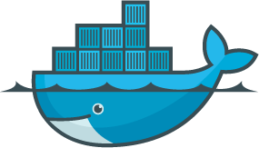

### **Introduction to Amazon ECS (Elastic Container Service)**

Amazon ECS (Elastic Container Service) is a fully managed container orchestration service that makes it easy to run, stop, and manage Docker containers on a cluster of Amazon EC2 instances or using AWS Fargate, which is a serverless compute engine for containers. ECS is highly scalable, reliable, and integrates seamlessly with other AWS services, making it an excellent choice for deploying microservices, batch jobs, and long-running applications.

        
### **Key Features of Amazon ECS**

1. **Scalable and Managed**: ECS scales your applications based on the demand, automatically managing the infrastructure and container orchestration tasks.  
2. **Integration with AWS Services**: ECS integrates well with other AWS services like AWS IAM for security, Amazon CloudWatch for logging and monitoring, AWS VPC for networking, and more.  
3. **Supports EC2 and Fargate**:  
   * **EC2 Launch Type**: Run containers on a cluster of EC2 instances, giving you control over the infrastructure.  
   * **Fargate Launch Type**: Serverless option where AWS manages the infrastructure, letting you focus only on your application.  
4. **Task Definitions**: Task definitions are blueprints that define how Docker containers should run, including container image, memory, CPU requirements, and networking.  
5. **Service Management**: ECS services allow you to run and maintain a specified number of instances of a task definition simultaneously, ensuring that your application remains available.

### **Getting Started with ECS**

#### **Step 1: Create an ECS Cluster**

1. Go to the ECS dashboard in the AWS Management Console.  
2. Click on "Clusters" and then "Create Cluster".  
3. Choose the cluster template (e.g., "EC2 Linux \+ Networking").  
4. Configure your cluster settings, including the cluster name and instance types if using EC2.  
5. Click "Create" to set up your cluster.

#### **Step 2: Define a Task Definition**

1. In the ECS dashboard, go to "Task Definitions".  
2. Click "Create new Task Definition".  
3. Choose the launch type (EC2 or Fargate).  
4. Define the task details, including container image, CPU, memory, and networking.  
5. Save the task definition.

#### **Step 3: Run a Task or Create a Service**

* **Run a Task**: To run a one-time task:  
  1. Go to the "Clusters" page, select your cluster, and click "Run Task".  
  2. Choose your task definition and other configurations like the number of tasks and network settings.  
  3. Click "Run Task".  
* **Create a Service**: To maintain a specified number of tasks running:  
  1. In your cluster, go to the "Services" tab and click "Create".  
  2. Select your task definition, specify the number of tasks, and configure load balancing if needed.  
  3. Click "Create Service".

### **Monitoring and Scaling ECS Services**

* **Monitoring**: Use Amazon CloudWatch to monitor your ECS services, set up alarms, and track performance metrics.  
* **Auto Scaling**: Configure ECS Service Auto Scaling to automatically adjust the number of tasks in your service based on demand, using scaling policies that react to CloudWatch metrics.

### **Benefits of Using Amazon ECS**

* **Cost-Effective**: Pay only for the resources you use, and scale out without manual intervention.  
* **High Availability**: ECS distributes tasks across multiple Availability Zones, ensuring high availability.  
* **Security**: ECS allows you to use IAM roles, security groups, and network ACLs to secure your application.  
* **Flexibility**: Choose between managing your infrastructure with EC2 or going serverless with Fargate.

### **Conclusion**

Amazon ECS simplifies the deployment and management of containerized applications, providing robust features for scaling, monitoring, and securing your applications. With ECS, you can focus on building and running your applications without worrying about the underlying infrastructure.

