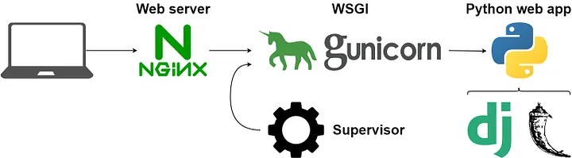

# Hosting a Django Application Using Gunicorn & Nginx on EC2 in Production

Deploying a Django application in production involves using Gunicorn as the application server and Nginx as a reverse proxy to handle client requests. This setup provides enhanced performance, security, and scalability for your application. Below is a comprehensive guide to setting up your Django application on an EC2 instance using Gunicorn and Nginx.


## Prerequisites

- AWS account with an EC2 instance running Ubuntu or another Linux distribution.
- SSH access to your EC2 instance.
- A Django application ready for deployment.
- Domain name (optional but recommended).

## Step 1: Set Up Your EC2 Instance

1. **Launch an EC2 Instance**:
   - Choose an Ubuntu AMI and a suitable instance type (e.g., t2.micro for testing).
   - Configure the security group to allow HTTP (port 80), HTTPS (port 443), and SSH (port 22) access.

2. **Connect to Your EC2 Instance**:
   - Use SSH to connect to your instance:
     ```bash
     ssh -i /path/to/your-key.pem ubuntu@your-ec2-public-ip
     ```

## Step 2: Install Required Software

1. **Update Packages and Install Dependencies**:
   ```bash
   sudo apt update
   sudo apt install python3-pip python3-dev libpq-dev nginx curl
   ```

2. **Install Virtualenv**:
   ```bash
   pip3 install virtualenv
   ```

3. **Clone Your Django Project**:
   - Clone your project from GitHub or upload your code:
     ```bash
     git clone https://github.com/yourusername/yourproject.git
     cd yourproject
     ```

4. **Create and Activate a Virtual Environment**:
   ```bash
   virtualenv venv
   source venv/bin/activate
   ```

5. **Install Python Dependencies**:
   ```bash
   pip install -r requirements.txt
   ```

## Step 3: Configure Gunicorn

1. **Install Gunicorn**:
   ```bash
   pip install gunicorn uvicorn uvicorn-worker
   ```

2. **Test Gunicorn with Your Django App**:
   ```bash
   gunicorn  --bind 0.0.0.0:8000 --workers 3 --worker-class uvicorn.workers.UvicornWorker my_website.wsgi:application
   ```
   - Ensure your Django app runs correctly by visiting `http://your-ec2-public-ip:8000`.

3. **Create a Gunicorn Systemd Service**:
   - Create a service file for Gunicorn:
     ```bash
     sudo nano /etc/systemd/system/gunicorn.service
     ```
   - Add the following configuration, replacing paths and project names accordingly:
     ```ini
     [Unit]
     Description=gunicorn daemon for Django project
     After=network.target

     [Service]
     User=ubuntu
     Group=www-data(make sure grp available)
     WorkingDirectory=/home/ubuntu/yourproject
     ExecStart=/home/dev/documents/spectraapi/myenv/bin/gunicorn --bind 0.0.0.0:4000 --workers 3 --worker-class uvicorn.workers.UvicornWorker rms_api.asgi:application

     Restart=always  # Ensures Gunicorn restarts automatically on failure or system reboot

     [Install]
     WantedBy=multi-user.target
     ```

4. **Reload the Systemd Daemon and Start Gunicorn**:
   ```bash
   sudo systemctl daemon-reload
   sudo systemctl start gunicorn
   sudo systemctl enable gunicorn
   ```

## Step 4: Configure Nginx as a Reverse Proxy

1. **Create Nginx Configuration File**:
   ```bash
   sudo nano /etc/nginx/sites-available/yourproject
   ```

2. **Add the Following Nginx Configuration**:
   ```nginx
   server {
       listen 80;
       server_name your_domain_or_public_ip;

       location / {
           include proxy_params;
           proxy_pass http://unix:/home/ubuntu/yourproject.sock;
       }

       location /static/ {
           alias /home/ubuntu/yourproject/static/;
       }

       location /media/ {
           alias /home/ubuntu/yourproject/media/;
       }

       error_page 500 502 503 504 /50x.html;
       location = /50x.html {
           root /usr/share/nginx/html;
       }
   }
   ```

3. **Enable the Configuration and Restart Nginx**:
   ```bash
   sudo ln -s /etc/nginx/sites-available/yourproject /etc/nginx/sites-enabled
   sudo nginx -t
   sudo systemctl restart nginx
   ```



## Step 5: Adjust Firewall Settings

- Ensure your security group allows HTTP and HTTPS traffic.
- Verify Nginx is serving your application by visiting your domain or public IP in the browser.


## Conclusion

You've successfully deployed your Django Websocket on AWS EC2 using Gunicorn, Uvicorn and Nginx. This setup ensures your application is production-ready with improved performance and security. Monitor your instance and application logs regularly to maintain smooth operation.

This guide provides a comprehensive overview of deploying a Django application in production on AWS EC2, covering all necessary steps from server setup to secure deployment with SSL.
