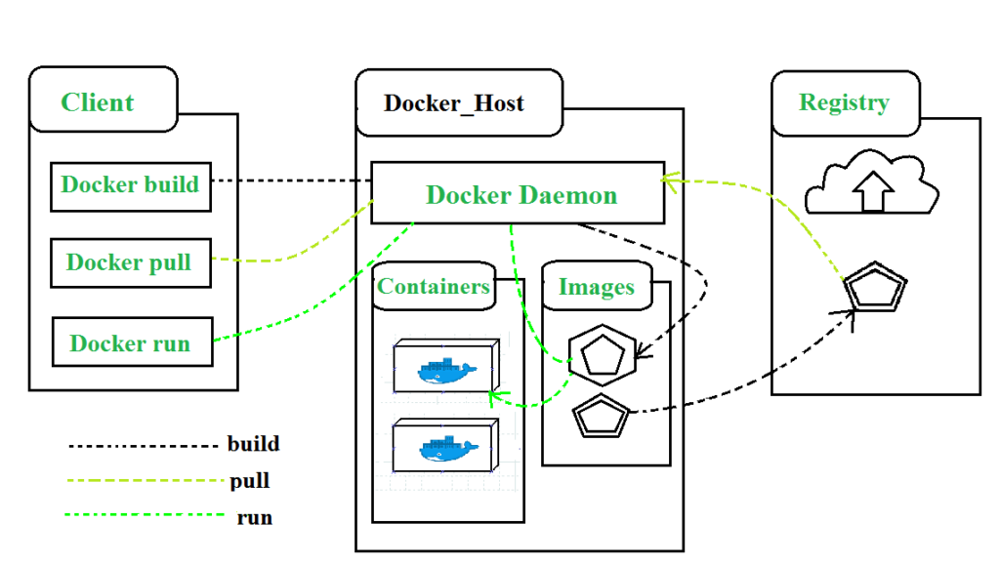

# What is Docker?

Docker is an open-source platform that automates the deployment, scaling, and management of applications using containerization technology. Containers are lightweight, portable, and ensure consistency across different environments, making it easier to build, ship, and run applications.

## Key Features of Docker

### 1. **Containerization**
Docker containers package applications and their dependencies into a single, portable unit. This ensures that applications run consistently regardless of where they are deployed.

### 2. **Docker Images**
Docker images are read-only templates used to create containers. They contain everything needed to run an application, including the code, runtime, libraries, and dependencies.

### 3. **Docker Hub**
Docker Hub is a cloud-based registry where users can store and share Docker images. It provides access to a wide range of pre-built images for various applications and services.

### 4. **Portability**
Docker containers can run on any system that supports Docker, including local machines, cloud platforms, and on-premises servers, providing flexibility in deployment.

### 5. **Isolation**
Containers offer process and filesystem isolation, which helps in avoiding conflicts between applications and ensures that each application has its own environment.

### 6. **Scalability**
Docker works seamlessly with orchestration tools like Kubernetes and Docker Swarm to manage and scale containerized applications across clusters of machines.

## How Docker Works

Docker operates using a client-server architecture. The Docker client interacts with the Docker daemon, which handles the creation, management, and orchestration of containers.

### Setting Up Docker

1. **Install Docker:**
   - Docker can be installed on various operating systems, including Windows, macOS, and Linux. Installation instructions are available on the [official Docker website](https://docs.docker.com/get-docker/).

2. **Create Docker Images:**
   - Write a `Dockerfile` that defines the environment and application setup, and build the image using `docker build`.

3. **Run Containers:**
   - Use the `docker run` command to start containers from your images.

4. **Manage Containers:**
   - Use commands like `docker ps` to list running containers and `docker stop` to stop them.

### Example Use Case

Imagine a development team building a web application. Using Docker, they can:

1. **Create a Docker Image:**
   - Define the application environment in a `Dockerfile` and build the image.

2. **Deploy Consistently:**
   - Run the application in containers on any environment (development, testing, production) without worrying about differences between environments.

3. **Scale:**
   - Deploy multiple instances of the application using Docker Swarm or Kubernetes to handle increased traffic.

## Conclusion

Docker simplifies application deployment and management through containerization, providing consistency and portability across different environments. Its integration with orchestration tools and extensive ecosystem makes it a valuable tool for modern software development.

For more detailed information, tutorials, and documentation, visit the [official Docker website](https://www.docker.com/).
