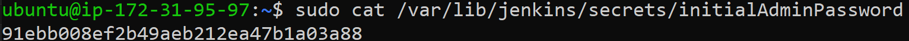
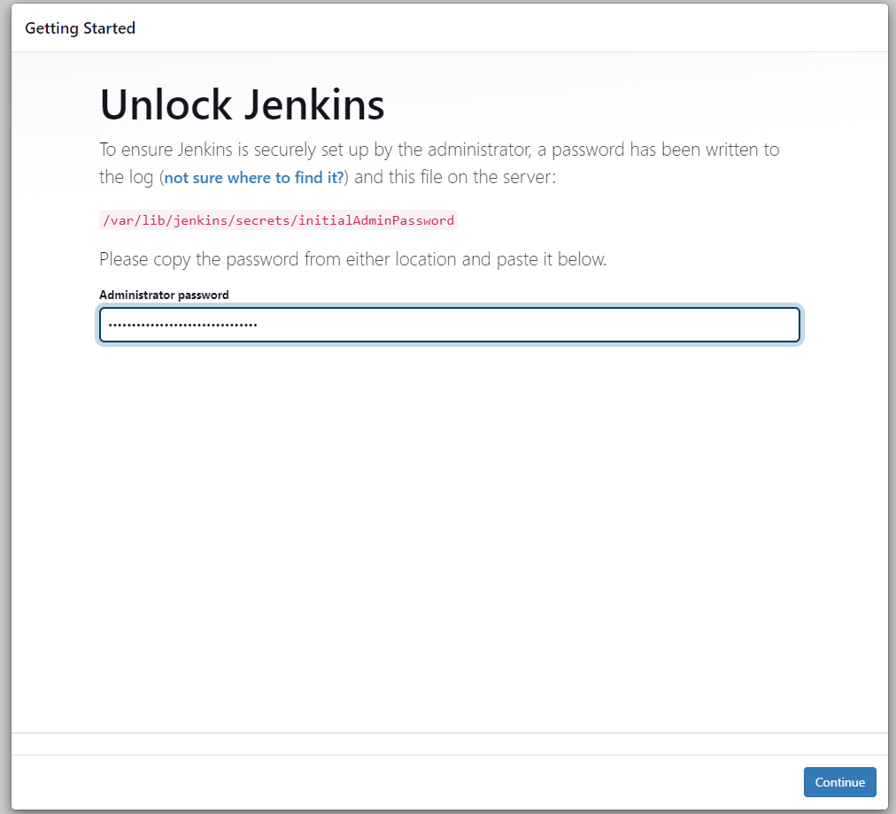
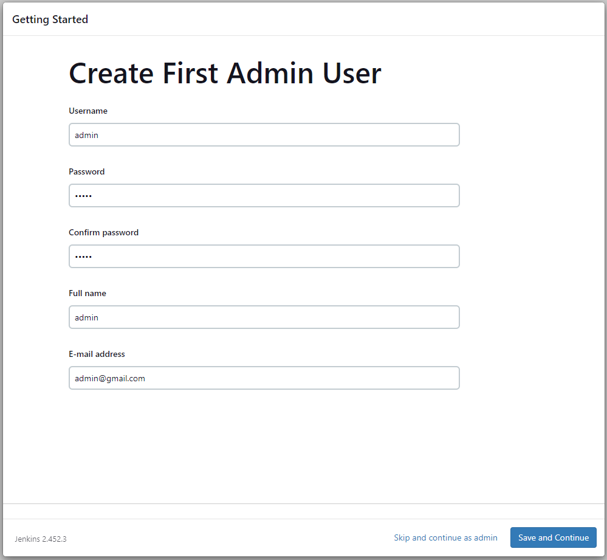

# How to Install and Set Up Jenkins on Linux


Jenkins is an open-source automation server that facilitates continuous integration and continuous delivery (CI/CD) in software development. This guide will walk you through the steps to install and set up Jenkins on a Linux system.

## Prerequisites


Before you start, ensure you have the following installed on your Linux system:

- Java Development Kit (JDK) 8 or 11

### Step 1: Install Java

Jenkins requires Java to run. You can install the Java Development Kit (JDK) by following these steps:

**On Ubuntu/Debian:**
```sh
sudo apt update
sudo apt install openjdk-11-jdk
```
**On CentOS/RHEL:**
```sh
sudo yum check-update
sudo yum install openjdk-11-jdk
```

### Step 2: Add Jenkins Repository and Key

**On Ubuntu/Debian:**
```sh
wget -q -O - https://pkg.jenkins.io/debian/jenkins.io.key | sudo apt-key add -
sudo sh -c 'echo deb http://pkg.jenkins.io/debian-stable binary/ > /etc/apt/sources.list.d/jenkins.list'
sudo apt update
```
**On CentOS/RHEL:**
```sh
sudo wget -O /etc/yum.repos.d/jenkins.repo https://pkg.jenkins.io/redhat-stable/jenkins.repo
sudo rpm --import https://pkg.jenkins.io/redhat-stable/jenkins.io.key
sudo yum check-update
```

### Step 3: Install Jenkins
Now you can install Jenkins using your package manager.

**On Ubuntu/Debian:**
```sh
sudo apt install jenkins
```
**On CentOS/RHEL:**
```sh
sudo yum install jenkins
```

### Step 4: Start and Enable Jenkins
Start the Jenkins service and enable it to start on boot.

**On Ubuntu/Debian:**
```sh
sudo systemctl start jenkins
sudo systemctl enable jenkins
```
**On CentOS/RHEL:**
```sh
sudo systemctl start jenkins
sudo systemctl enable jenkins
```

### Step 5: Open Port 8080
To ensure Jenkins is accessible, you need to open port 8080. This is especially important if you're running Jenkins on a cloud instance or within a Virtual Private Cloud (VPC). The process for opening port 8080 varies depending on your cloud provider. Follow the specific instructions for your cloud platform to open port 8080 and allow access to Jenkins.

### Step 6: Access Jenkins
Open your web browser and navigate to http://localhost:8080 or http://YOUR-IP:8080 to access the Jenkins setup screen.


### Step 7: Unlock Jenkins
During the initial setup, Jenkins requires an unlock key. Retrieve the initial admin password by running the following command:
```sh
sudo cat /var/lib/jenkins/secrets/initialAdminPassword
```


Copy & past These password at Start page



### Step 8: Customize Jenkins
**1.Install Suggested Plugins:**
- Jenkins will prompt you to install plugins. Click on 'Install suggested plugins' to install the most commonly used plugins.

**2.Create First Admin User:**
- After the plugins are installed, you will be prompted to create the first admin user. Fill in the details and click 'Save and Finish.'

**3.Instance Configuration:**
- Confirm the Jenkins URL and click 'Save and Finish.'

### Step 9: Start Using Jenkins
Once the setup is complete, you will be redirected to the Jenkins dashboard, where you can start creating jobs and configuring your CI/CD pipelines.

## Conclusion

By following these steps, you have successfully installed and set up Jenkins on your Linux system. Jenkins is now ready to use for automating your build, test, and deployment processes, helping you achieve continuous integration and continuous delivery.

For more detailed information, tutorials, and documentation, visit the [official Jenkins website](https://www.jenkins.io/).

