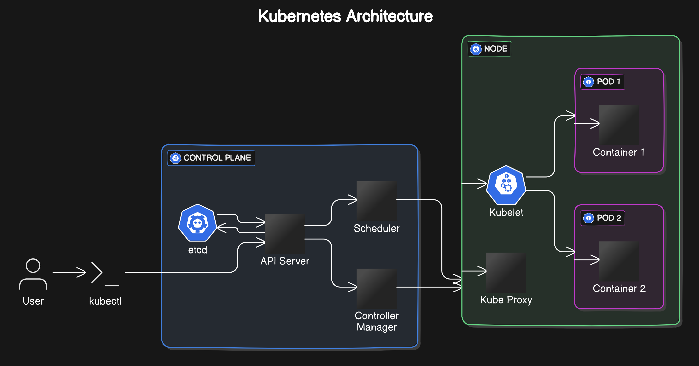

# Architecture of Kubernetes

Kubernetes uses a master-slave architecture to manage and orchestrate containerized applications. It consists of several components that work together to maintain the desired state of the applications running in the cluster.

## Key Components of Kubernetes Architecture

### 1. **Master Node**
The master node is responsible for managing the Kubernetes cluster. It consists of several components:

#### a. **API Server**
The API Server is the central management point of the Kubernetes cluster. It exposes the Kubernetes API and processes RESTful requests to create, update, delete, and retrieve Kubernetes resources.

#### b. **etcd**
etcd is a distributed key-value store used to store all the cluster data. It provides a consistent and reliable way to store configuration data, metadata, and state of the cluster.

#### c. **Controller Manager**
The Controller Manager runs various controllers that handle routine tasks, such as node management, replication, and endpoint monitoring. Controllers ensure that the desired state of the cluster matches the actual state.

#### d. **Scheduler**
The Scheduler is responsible for placing containers on the appropriate nodes based on resource requirements, constraints, and availability. It watches for newly created pods with no assigned node and selects a node for them to run on.

### 2. **Worker Nodes**
Worker nodes run the containerized applications. Each worker node contains the following components:

#### a. **kubelet**
The kubelet is an agent that runs on each worker node. It communicates with the API Server and ensures that containers are running in pods as expected. The kubelet watches for pod specifications and reports back to the master node.

#### b. **Container Runtime**
The Container Runtime is responsible for running containers on the worker node. Kubernetes supports various container runtimes, including Docker, containerd, and CRI-O.

#### c. **kube-proxy**
The kube-proxy is a network proxy that runs on each worker node. It maintains network rules and handles communication between pods and services, providing load balancing and forwarding network traffic.

### 3. **Pods**
A Pod is the smallest and simplest Kubernetes object. It represents a single instance of a running process in the cluster. Pods can contain one or more containers that share the same network namespace and storage.

### 4. **Services**
A Service is an abstraction that defines a logical set of Pods and a policy for accessing them. Services provide stable IP addresses and DNS names to enable communication between different parts of the application.

### 5. **Namespaces**
Namespaces provide a way to divide cluster resources between multiple users or applications. They create isolated environments within the same cluster, making it easier to manage and organize resources.

### 6. **Volumes**
Volumes provide persistent storage for containers. Kubernetes supports various types of volumes, including hostPath, emptyDir, and network storage solutions like NFS and AWS EBS.

### 7. **Ingress**
Ingress manages external access to services within a cluster, typically HTTP and HTTPS traffic. It provides load balancing, SSL termination, and name-based virtual hosting.

### Example Architecture Diagram

In the diagram above:
- The Master Node contains the API Server, etcd, Controller Manager, and Scheduler.
- Worker Nodes contain the kubelet, container runtime, and kube-proxy.
- Pods run on Worker Nodes, with containers inside them.
- Services, Ingress, and other resources are defined to manage communication and access.

## Conclusion

The architecture of Kubernetes is designed to provide a robust, scalable, and flexible platform for managing containerized applications. By leveraging the master-slave architecture and various components, Kubernetes ensures that applications run reliably and efficiently across diverse environments.

For more detailed information, tutorials, and documentation, visit the [official Kubernetes website](https://kubernetes.io/).
