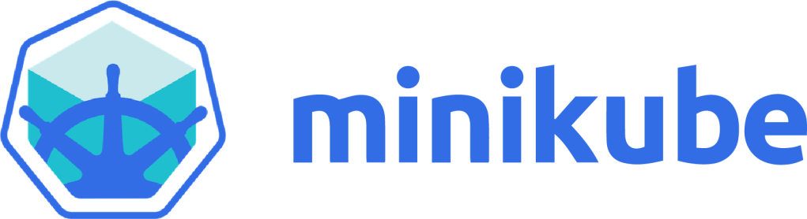

## **Kubernetes on Local using Minikube**

### **Introduction**

Kubernetes is a powerful open-source platform for automating the deployment, scaling, and management of containerized applications. Minikube is a tool that lets you run Kubernetes locally, enabling you to test and develop your Kubernetes applications without needing a full-blown cloud environment.



### **Key Features of Minikube**

* **Single-Node Kubernetes Cluster**: Minikube runs a single-node Kubernetes cluster on your local machine, making it easy to get started with Kubernetes.  
* **Supports Most Kubernetes Features**: You can use Minikube to test Kubernetes features like Pods, Deployments, Services, and more.  
* **Cross-Platform**: Minikube supports Linux, macOS, and Windows.

### **Setting Up Minikube**

**Step 1: Install Minikube**

* For Linux:  
```bash
curl -LO https://storage.googleapis.com/minikube/releases/latest/minikube-linux-amd64
```
```bash
sudo install minikube-linux-amd64 /usr/local/bin/minikube
```

* For macOS:  
```bash 
brew install minikube
```
* For Windows:  
  * Download the Minikube installer from the [Minikube GitHub releases page](https://github.com/kubernetes/minikube/releases).  
  * Follow the installation instructions.

**Step 2: Install kubectl**

Install kubectl the Kubernetes command-line tool, which is required to interact with your Kubernetes cluster.

```sh
curl -LO "https://dl.k8s.io/release/$(curl -L -s https://dl.k8s.io/release/stable.txt)/bin/linux/amd64/kubectl"`
```
```sh
sudo install -o root -g root -m 0755 kubectl /usr/local/bin/kubectl
```

**Step 3: Start Minikube**

* Start a Kubernetes cluster using Minikube
  ```sh
  minikube start
  ```  
* This command sets up a single-node Kubernetes cluster on your local machine.

### **Deploying an Application**

**Step 1: Create a Kubernetes Deployment**

Create a simple deployment using `kubectl`. For example, to deploy an Nginx server:  
```sh
kubectl create deployment nginx --image=nginx
```


**Step 2: Expose the Deployment**

Expose the Nginx deployment to make it accessible outside the cluster:  
```sh
kubectl expose deployment nginx --type=NodePort --port=80
```
**Step 3: Access the Application**

Use Minikube’s service command to get the URL for accessing your application:  
```sh
minikube service nginx --url
```

Open the URL in your web browser to see the Nginx welcome page.

### **Managing the Cluster**

**Check Cluster Status**:  
```sh
kubectl get nodes
```

**Scale the Deployment**:  
```sh
kubectl scale deployment nginx --replicas=3
```

**View Logs**:  
```sh
kubectl logs deployment/nginx
```


### **Advantages of Using Minikube**

* **Local Development**: Perfect for local development, testing, and learning Kubernetes.  
* **Lightweight**: Minikube is lightweight, requiring minimal resources.  
* **Easy to Use**: Simple setup process with support for most Kubernetes features.

### **Conclusion**

Minikube provides an easy and efficient way to run Kubernetes locally, making it a great choice for developers who want to experiment with Kubernetes or develop containerized applications on their local machine. With Minikube, you can learn and explore Kubernetes in a controlled, local environment before moving to production.

