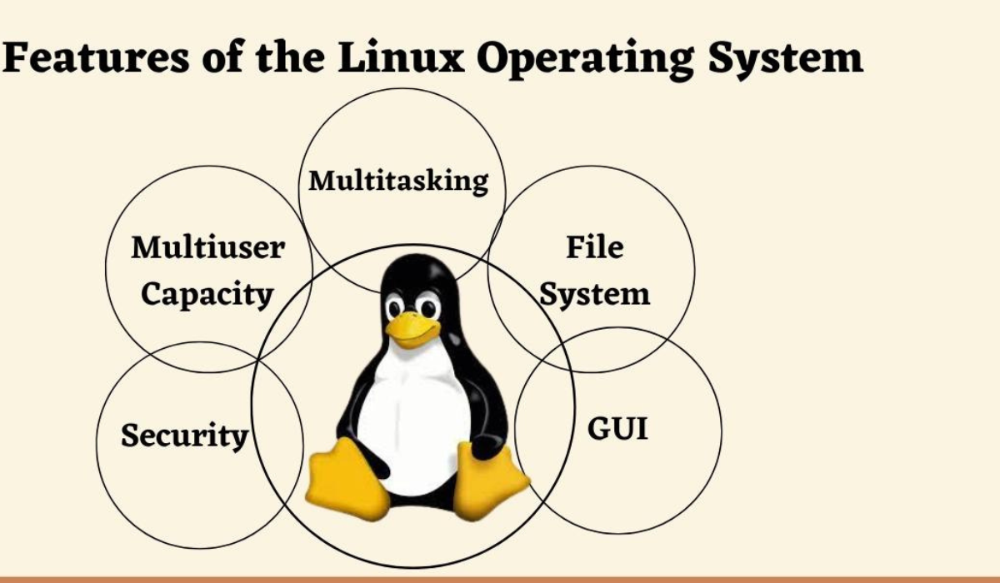

# What is Linux?

Linux is an open-source, Unix-like operating system kernel that serves as the foundation for many different operating systems, commonly referred to as Linux distributions. It is known for its stability, security, and versatility, making it a popular choice for servers, desktops, and embedded systems.

## Key Features of Linux

### 1. **Open Source**
Linux is freely available and its source code can be modified and redistributed by anyone. This open-source nature fosters community collaboration and innovation.

### 2. **Multiuser Capabilities**
Linux supports multiple users simultaneously, with robust user and permission management. This allows for efficient multiuser environments and secure access controls.

### 3. **Security**
Linux offers strong security features, including user permissions, file system encryption, and regular security updates, making it a secure choice for various applications.

### 4. **Stability and Reliability**
Linux is known for its stability and reliability. It is widely used in server environments due to its ability to handle long uptimes and high workloads.

### 5. **Flexibility and Customization**
Linux can be customized to suit different needs, from lightweight distributions for older hardware to full-featured desktop environments for modern systems.

### 6. **Community Support**
The Linux community is vast and active, providing extensive resources, forums, and documentation for users and developers.

## How Linux Works

Linux is based on a modular architecture that separates the kernel from user space. The kernel manages hardware resources and provides essential services, while user space includes various applications and utilities.

### Setting Up Linux

1. **Choose a Distribution:**
   - There are many Linux distributions (distros) available, such as Ubuntu, Fedora, and CentOS. Choose one based on your needs and preferences.

2. **Install Linux:**
   - Download the distribution's ISO file and create a bootable installation media. Follow the installation guide provided by the distribution.

3. **Configure System:**
   - After installation, configure the system settings, install additional software, and set up user accounts.

4. **Manage System:**
   - Use package managers (e.g., `apt`, `yum`, `dnf`) to install and update software. Utilize commands like `top`, `ps`, and `df` for system monitoring and management.

### Example Use Case

Consider a company deploying web servers. Using Linux, they can:

1. **Choose a Distribution:**
   - Select a server-oriented distribution like Ubuntu Server or CentOS.

2. **Install and Configure:**
   - Install the distribution on server hardware or virtual machines, and configure necessary services such as Apache or Nginx.

3. **Manage and Monitor:**
   - Use Linux tools and commands to monitor server performance, manage user access, and handle security updates.

## Conclusion

Linux provides a powerful and flexible operating system that powers a wide range of devices and applications. Its open-source nature, stability, and extensive community support make it an ideal choice for many computing needs.

For more detailed information, tutorials, and documentation, visit the [official Linux website](https://www.linux.org/).
